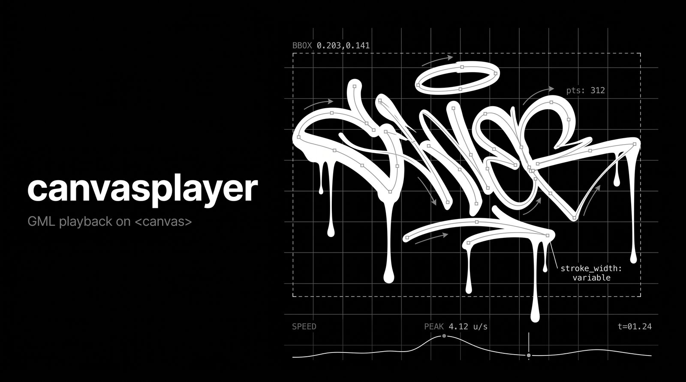

# canvasplayer

Plays Graffiti Markup Language (GML) tags on `<canvas>`. It reads a tag from
[#000000book](https://000000book.com), fixes the timing and plays it back at
the speed the hand moved. No dependencies. No build step.

Demo: https://jamiew.github.io/canvasplayer

Two renderers share this parser:

| | | |
|---|---|---|
| `canvasplayer` | flat 2D canvas, 6 ink modes | [demo](https://jamiew.github.io/canvasplayer/?renderer=canvas) |
| `canvasplayer/three` | WebGL, time as depth, particle dust, after [Evan Roth's 3D fork](https://github.com/evanroth/canvasplayer/tree/ga4-3d-player) | [demo](https://jamiew.github.io/canvasplayer/?renderer=webgl) |

The 2D one is the package. The WebGL one is optional and you bring your own
three.js, so it costs nothing until you import it.

## Install

    npm install canvasplayer

Or copy the files next to your page and import them by path. On Rails with
Propshaft, put them in `public/`. Propshaft does not rewrite imports.

three.js is an optional peer. Install it only if you want the WebGL renderer.

## Use

These examples use npm import names. In a browser without an import map,
replace them with paths to the copied files.

    
<canvas></canvas>

    

The canvas fills its parent. Size that element.

`147.json` is what https://000000book.com/data/147.json returns. The API sends
no CORS header yet. A page on another site must load it with JSONP. The demo
page shows how.

Add controls if you want them:

    import { transport, switches } from 'canvasplayer/ui';

    const disposeTransport = transport(player, document.querySelector('#transport'));
    const disposeSwitches = switches(player, document.querySelector('#switches'));

    // Call this when the stage leaves the page:
    function unmount() {
      disposeTransport();
      disposeSwitches();
      player.destroy();
    }

Link `gml-ui.css` too. It takes colors from `--ink`, `--paper`, `--mute` and
`--rule`, so the controls match your page.

Controls read the current player state when mounted and follow changes made
through its setters. In v7, both helpers return a disposal function, not the
host element. Calling it twice is safe. It removes only that helper's nodes
and listeners, leaving other host content alone.

## Runnable examples

Serve the repo with `python3 -m http.server 8420`, then open
http://localhost:8420/examples/iframe.html or one of the pages below.
They use relative module imports, with no bundler or import map.
These files live in the repo, not the npm package. When copying them, keep
the module and examples directory layout or adjust their import paths.
The gallery, player and drawing pages also need `examples/demo-theme.js` and
`examples/demo-theme.css`. The gallery shares `examples/demo-header.css` with
the main demo. These keep the theme and navigation consistent across pages.

| Example | What to copy |
|---|---|
| [Draw one frame](examples/draw.html) | `parse` and `prepare` from `gml.js`, then `paint` from `gml-player.js`. No animation loop or UI. |
| [Player and controls](examples/player.html) | `GmlPlayer`, optional `transport` and `switches`, and their stylesheet. The Remove player button demonstrates disposal. |
| [Animation only](examples/playback.html) | `GmlPlayer` filling its frame, with no controls or UI imports. Reduced motion shows the finished tag. |
| [Iframe gallery](examples/iframe.html) | Three live embeds and their markup, under the same demo header and navigation. The parent imports no player code or UI stylesheet. |

The examples share [tag.json](examples/tag.json), a small copy of the drawing
and client name from [tag #100](https://000000book.com/data/100.json), captured
with eyeSaver-003. They make no external data requests. Replace that file or
its fetch URL with your own GML JSON.

## Embed with an iframe

Yes. Host `examples/player.html` alongside its modules and JSON, then point
an iframe at it. It works on the same origin or a different one:

    <iframe
      src="./examples/player.html"
      title="Graffiti player"
      loading="lazy"
      style="width: 100%; height: 800px; border: 0">
    </iframe>

Use an absolute HTTPS URL for `src` when the player lives on another site.
The frame loads its modules and data relative to its own URL. The iframe
itself does not require CORS. Fetching data from a third origin still does.

You can also frame the full demo:
`https://jamiew.github.io/canvasplayer/?renderer=canvas&id=147&fullscreen=1`.
Here, fullscreen means filling the iframe with the demo layout, not taking
over the browser screen. It needs no fullscreen permission.

- Set a width and height on the iframe. Keep scrolling available when using a
  fixed height, especially at narrow widths. The player fits its own stage;
  it does not automatically set the height of the outer iframe.
- The same-origin gallery includes a small `ResizeObserver` sizing script.
  It fits the player and drawing frames to their content and shrinks a frame
  after removal. Its source includes a copyable example. Cross-origin hosts
  cannot use this DOM measurement.
- The host's `frame-src` policy must permit the player URL. The player server
  must also allow framing through its `frame-ancestors` and `X-Frame-Options`
  headers.
- The example does not need a `sandbox` attribute. If you add one, its normal
  module imports and local JSON fetch need `allow-scripts allow-same-origin`.
  Do not treat that combination as isolation for untrusted same-origin code.
- Cross-origin parents cannot call the player's methods through the frame's
  DOM. Use the controls inside the frame. There is no built-in `postMessage`
  control API.

## What you get

`canvasplayer/gml` reads GML. It has no DOM and no canvas, so you can draw
the result with anything.

- `parse(json, id)` turns the #000000book tree into strokes
- `prepare(tag, options)` fixes timing, measures speed and width, finds the
  bounds and plans the drips
- `progress(strokes, t)` says how far each stroke has got at time t
- `isLandscape(environment, strokes)` says if the capture was sideways

`canvasplayer` draws.

- `paint(ctx, tag, frame)` draws one frame on any 2D context. It works with
  OffscreenCanvas and Node canvas libraries.
- `fit(bounds, w, h, pad)` says where the drawing lands in a frame
- `GmlPlayer(canvas, tag, options)` runs a canvas: sizing, clock and events
- `MODES`, `EFFECTS`, `LAYERS` and `DEFAULTS`

`canvasplayer/ui` builds controls: `transport` and `switches`. It imports
nothing from either renderer, and asks the player what it can do.

`canvasplayer/three` draws the same tags in WebGL: time on the z axis, and a
dust field the writing hand shoves around. It imports the shared preparation
code, but not three.js. Hand it your own `THREE`:

    import * as THREE from 'three';
    import { ThreePlayer } from 'canvasplayer/three';

    const player = new ThreePlayer(THREE, canvas, tag);
    player.play();

Tested against r160, which is what the demo pins. It uses core three.js APIs.
Both players expose `load`, `play`, `pause`, `toggle`, `seek`, `setSpeed`,
`time`, `duration`, `playing`, `destroy`, `on` and `off`.

A tag looks like this. Make one from anything.

    { id, app, rotate, strokes: [ { points: [[x, y, time], ...] } ] }

x and y run from 0 to 1. time is in seconds.

Both players accept the parsed shape above, not a prepared tag.
`paint()` takes the result of `prepare()`. Treat prepared tags as immutable:
the painter caches geometry and previews by tag identity.

## Playback and lifecycle

- `load(tag)` resets time and immediately draws the new tag. It does not
  change whether playback is running.
- `seek(seconds)` clamps to the tag's duration and draws immediately. Call
  `pause()` first if you want playback to stay there.
- The 2D player accepts `{ loop: false }`. Playing a completed tag, or one
  explicitly sought to its endpoint, starts it again. A pause during the
  end hold still resumes that hold.
- WebGL loops through writing, hold and fade. Seeking clears the dust rather
  than pretending its simulated history can run backwards.
- Both players follow parent size and pixel density. `destroy()` stops the
  clock and removes player listeners and sizing observers. WebGL also
  releases its input handlers and renderer resources.

`on(name, callback)` and `off(name, callback)` return the player for chaining.
`off` removes every registration of that callback for the named event.

| Event | Payload |
|---|---|
| `load` | prepared tag |
| `frame` | `{ time, duration }` |
| `state` | `{ playing }` |
| `config` | none; read the current player settings |

Use the setters to change speed, mode, effects or layers. They emit `config`
when a value changes, so mounted controls stay in sync.

## Embed on 000000book

Copy the 2D modules and optional controls into `public/canvasplayer/`.
The same-origin page can fetch `/data/147.json` directly. It needs neither
JSONP nor a CORS change; those are concerns for the separate demo site.

Give each stage an explicit size. Set `background: 'transparent'` in the
2D player's options if the host page should show through. Dispose controls
and destroy the player when removing a stage. Construct a new player when
mounting it again.

For browse-page thumbnails, prepare the tag and call `paint()` once at its
duration. Reserve running players for visible, interactive stages rather
than animating every item on the page.

## How it draws

Capture apps write bad times: zeroes, unix epochs, samples out of order and
minute-long stalls. The timeline is fixed first. What changed is counted on
`tag.timing`.

Line width follows the hand. Slow is wide. Fast is thin. Ink runs from where
the line is widest.

6 ink modes. `marker` is a ribbon through the samples, wide where the hand was
slow. `chisel` is a flat nib at a fixed angle, so width comes from direction.
`outline` draws the silhouette only, which is the shape a writer lays down
before filling it. `dyna` tows a brush with mass along the path on a spring
and draws where the brush went, after Paul Haeberli's
DynaDraw. `hairline` and `skeleton` are diagrams.

5 effects. `ghost` shows the whole tag faint underneath. `smooth` curves marker
and outline between samples. `bleed` soaks the ink outwards. `jitter` nudges
every sample by noise. `fade` dims old ink.

Path smoothing is off by default. Sparse captures such as tag #100 keep their
recorded straight sides. Enable it with the **smooth** button or
`player.setEffect('smooth', true)`. For a single frame, pass
`effects: { smooth: true }` to `paint()`. `smoothSteps` controls the curve's
subdivisions when enabled.

The curve uses recorded neighbours, not the moving tip, so playback no longer
bends ink already drawn. This is separate from the `smoothing` preparation
option, which smooths speed measurements for line width. Dyna caches its
spring trajectory and ribbon normals, so playback and moving fade slices
reveal the same ink rather than reshaping it.

WebGL updates only the active ribbon edge and simulates dust in fixed
1/120-second tag-time steps. Catch-up work after a long stall is capped at
one second per display frame.
Dust impulses stay in capture units rather than grid-cell units, so grid
density does not multiply the force. Gravity scales with the artwork.
Portrait frames adjust camera distance without resetting orbit or zoom.

Time as depth and the particle dust are the WebGL renderer's, not the 2D
one's. A 2D version of them lived on the `native-3d` branch, kept at the
[`v6.1-native-3d`](https://github.com/jamiew/canvasplayer/releases/tag/v6.1-native-3d)
tag: all 8 ink modes in depth, no dependency, and slower.

The frame takes the window with the fullscreen button, next to the light and
dark toggle. It is a layout mode rather than the browser's fullscreen API, so
it works in an iframe and can be linked to with `?fullscreen=1`. Escape
exits. The renderer links carry the tag across, so switching renderer keeps
showing what you were looking at.
Narrow and short fullscreen views hide the settings panel; leave fullscreen
to change the ink. Short frames reserve room for the transport below the
drawing instead of covering it.

6 data layers, for checking a tag. `ink` and `drips` are the drawing.
`vectors` are arrows for direction and speed. `points` marks every sample.
`bounds` draws the screen, the box and a grid. `graph` plots speed over time.

It opens in marker with ghost and drips on.

Sideways captures get a quarter turn. The up vector decides. If there is
none, y past 1 means sideways.

## Run it

Any static server works. Modules do not load from `file://`.

    python3 -m http.server 8420

Open http://localhost:8420/?id=161. `?latest` and `?random` work too, and
`?renderer=webgl` switches renderer.

    npm test

Tests need no browser and no network.

## History

Started in 2009 for GML Week at F.A.T. Lab as a Processing.js sketch. v4
dropped Processing.js and fixed the maths. v6 split it into modules and put
it on npm. v7 brought the WebGL renderer back onto one branch.

The drawing modes are borrowed too. `dyna` is Paul Haeberli's DynaDraw (1989),
which filtered a mouse through a mass on a spring and drew the mass. The
removed `sketch` mode followed Jo Wood and colleagues' sketchy rendering,
the method behind Handy and Rough.js. The removed `spray` mode used the
Gaussian that airbrush simulations have used since the 1980s.

Public domain, Jamie Wilkinson & Free Art & Technology (F.A.T.) Lab.
No rights reserved.
